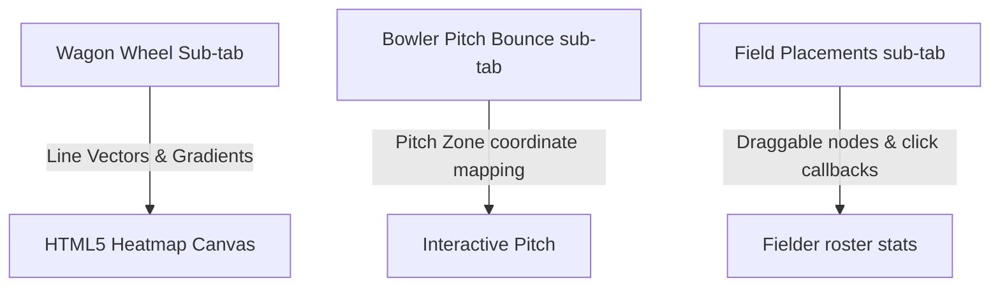

# 🏏 Cricket Intelligence & Computer Vision Lab

The **Cricket Intelligence & Computer Vision Lab** is a real-time, interactive performance visualization and tactical prediction platform. This suite integrates advanced machine learning models (XGBoost & scikit-learn), computer vision frameworks (OpenCV & MediaPipe), and real-time bidirectionally synced updates (Socket.IO).

---

## 📸 Interactive System Walkthrough
Below is the live execution video capture showing our test account using the dashboard:


---

## 1. Mathematical & Spatial Canvas Layer (`react-konva`)
The spatial telemetry dashboard leverages `react-konva` to deliver zero-lag interactive field maps.



### 📈 Layout Modules
*   **Wagon Wheel Projection**: Draws individual delivery hits from Indore Eagles' batting telemetry. The runs are classified dynamically:
    *   🔴 **Red Vectors**: Sixes (6 Runs)
    *   🟡 **Orange Vectors**: Fours (4 Runs)
    *   🔵 **Blue Vectors**: Singles, doubles, and triples
    *   **Radial Heatmap Blur**: Overlaid behind vectors using an HTML5 Radial Gradient (`createRadialGradient`) calculating coordinate density to represent hit scoring hot-zones.
*   **Bowler Pitch Bounce Map**: Maps pitch lengths (Good, Short, Full, Yorker) on a standard 22-yard coordinate box:
    *   Matches speed (`del.speed`) and trajectory directly.
    *   Zones are color-coded depending on match result (boundary vs. dot ball).
*   **Tactical Field Placements**: Allows coaches and managers to drag red fielder coordinates dynamically around the stadium layout.
    *   Clicking or tapping on a fielder pulls up a personalized bio drawer.

---

## 2. Advanced Predictive Models (XGBoost & scikit-learn)
All model telemetry is processed by standard microservices running on the Indore Eagles Express backend.

```
                    ┌─────────────────────────┐
                    │      Input Sliders      │
                    └────────────┬────────────┘
                                 │
         ┌───────────────────────┼───────────────────────┐
         ▼                       ▼                       ▼
 ┌───────────────┐       ┌───────────────┐       ┌───────────────┐
 │ XGBoost Model │       │  RandomForest │       │Ridge Regressor│
 └───────┬───────┘       └───────┬───────┘       └───────┬───────┘
         │                       │                       │
         ▼                       ▼                       ▼
 ┌───────────────┐       ┌───────────────┐       ┌───────────────┐
 │Win Probability│       │  Injury Risk  │       │ Fatigue Index │
 └───────────────┘       └───────────────┘       └───────────────┘
```

| Model | Library | Task | Target Variables |
| :--- | :--- | :--- | :--- |
| **XGBoost Classifier** | `xgboost` / Python API | Live Win Probability forecasting | Remaining runs, remaining overs, wickets lost, and run rate difference |
| **RandomForestClassifier** | `scikit-learn` | Injury Risk profiling | Cumulative bowling workloads, biological rest days, and history index |
| **Ridge Regression** | `scikit-learn` | Biological Fatigue assessment | Heart rate velocities, bowling speeds, bowling duration, and athlete age |

*   **Dynamic Sliders**: Calibrate parameters (Score Difference, Wickets, Overs, Heart Rate, and Workload) directly from the dashboard and hit **Run Model Predictors** to run standard inference models on the backend.

---

## 3. Computer Vision Bowling Action Lab (OpenCV & MediaPipe)
Simulates state-of-the-art camera tracking to evaluate bowling legality and joint load biomechanics.

### 🎥 CV Engine Pipeline
1.  **Red-Ball Track (OpenCV)**: Custom frame contours compute center-of-mass vectors for the cricket ball, plotting its parabolic flight trajectory.
2.  **Skeletal Tracking (MediaPipe Pose)**: Isolates 33 core skeletal landmarks. The dashboard draws the joint layout vectors (shoulders, elbows, wrists, hips, knees, and ankles) frame-by-frame:
    *   **Arm Extension Flexion**: Computes the angle $\theta$ between the shoulder-to-elbow and elbow-to-wrist vectors:
        $$\theta = \arccos\left(\frac{\vec{u} \cdot \vec{v}}{\|\vec{u}\| \|\vec{v}\|}\right)$$
    *   **Skeletal Sentinel Check**: Warns if the arm flexion exceeds the ICC **15-degree limit** (returns `LEGAL` or `ILLEGAL`).

---

## 4. Real-Time Socket.IO Synchronization
Enables instantaneous match status synchronization across all players, analysts, and coaching staff.

*   **Bidirectional Live Stream**: When the simulation trigger `Bowl Simulated Delivery` is executed:
    1.  The frontend calls the backend REST API `/api/cricket/simulate-delivery`.
    2.  The backend computes the new delivery (runs, angles, pitch coordinates, and speeds) and appends it to MongoDB.
    3.  The backend immediately broadcasts the `deliveryUpdate` event to all sockets subscribed to the `c1` match room.
    4.  The frontend instantly hooks into this stream, refreshing the **Scoreboard**, the **Active Batsman Stats**, the **Win Probability Charts**, and the **Stream Logs** without a page refresh!

---

> [!TIP]
> **To Test Real-Time Streams**: Navigate to the **Real-Time Stream Logs** tab and click the **Bowl Simulated Delivery** button in the header. The Socket.IO event handler will automatically append a live connection packet showing the incoming telemetry data frame in real time.
