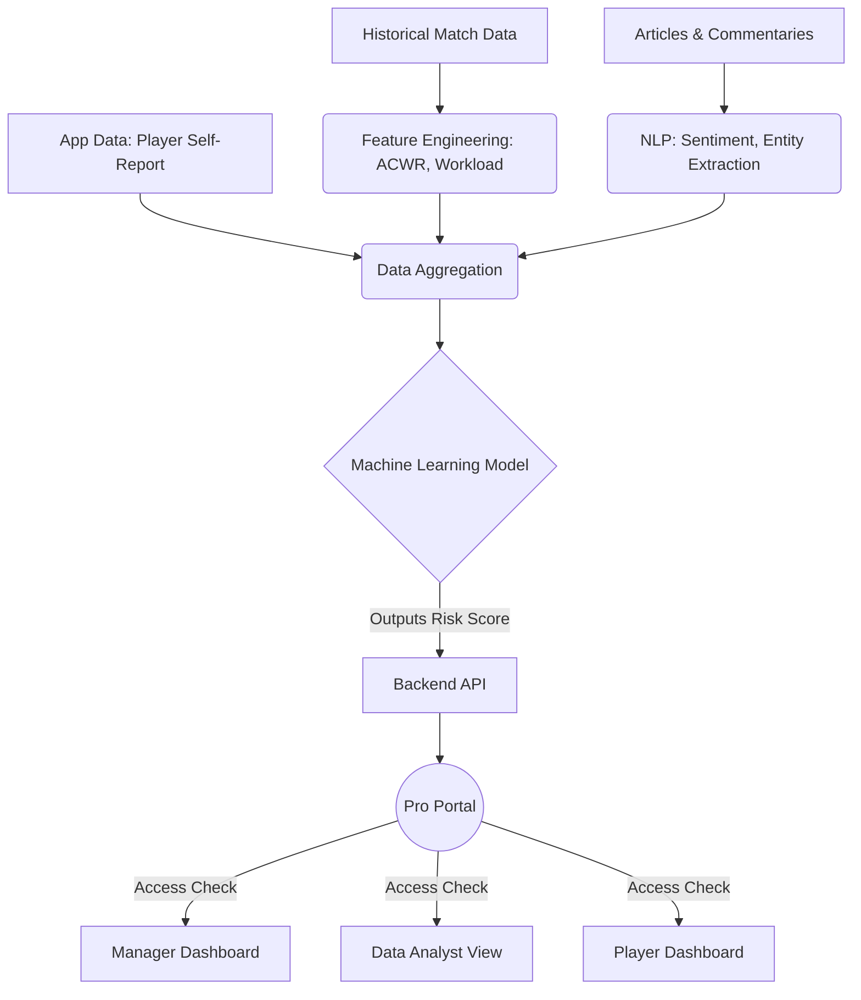

# Injury Prediction Module Roadmap & Workflow

This document outlines the workflow for predicting player injuries using historical data, articles, commentaries, and application data, bypassing the need for live IoT devices. 

## 1. Data Sources & Collection

Since live IoT data is unavailable, the model will rely on alternative data streams to gauge a player's physical state and workload:

*   **Historical Match Data (Workload):** Tracking matches played, minutes played, and rest periods between matches.
*   **Textual Data (NLP):** Scraping and analyzing news articles, match commentaries, and press conferences. We look for keywords like "niggle," "discomfort," "fatigue," or "resting."
*   **Application Data:** Self-reported data from the player within the app (e.g., subjective fatigue levels, sleep quality, soreness).

## 2. Data Processing & Feature Engineering

Transforming raw data into predictive features:

*   **Workload Metrics:** Calculate the **Acute:Chronic Workload Ratio (ACWR)**. This compares the player's short-term workload (last 7 days) against their long-term workload (last 28 days). Spikes in ACWR are strong indicators of injury risk.
*   **NLP Pipeline:** Use Natural Language Processing (e.g., BERT, SpaCy) to extract sentiment and specific injury-related entities from commentaries and articles. This creates a "fatigue score" or "knock indicator" based on media/commentary mentions.
*   **Aggregation:** Combine workload metrics, NLP scores, and player-reported data into a unified timeline for each player.

## 3. Modeling & Prediction

Training a machine learning model to estimate injury risk:

*   **Algorithm:** Use models suited for tabular and time-series data, such as **XGBoost, Random Forest**, or **LSTMs**.
*   **Target Variable:** Predict the probability of an injury occurring in the next *N* days (e.g., 7 or 14 days).
*   **Output:** Classify the risk into actionable bands: **Low, Medium, High**, alongside a percentage probability.

## 4. Integration into Pro Portal

The prediction results will be surfaced exclusively on the Pro Portal with strict Role-Based Access Control (RBAC):

*   **Manager View:** Dashboard showing the squad's overall injury risk. Alerts for players entering the "High Risk" zone to inform rotation and selection decisions.
*   **Data Analyst View:** Detailed breakdown of the factors contributing to the risk score (e.g., showing that the risk is high due to a spike in ACWR combined with commentary mentioning a recent knock).
*   **Player View:** Personal dashboard showing their own risk level and personalized recovery recommendations based on their app inputs.

## Workflow Diagram

## Next Steps for Implementation

1.  **Data Gathering:** Start collecting historical match data and scraping relevant news/commentary sources for a test dataset.
2.  **Prototype NLP:** Build a simple script to parse commentaries and flag potential physical issues.
3.  **API Development:** Create the Pro Portal endpoints with proper RBAC to ensure only authorized users (Managers, Analysts, Players) can access the data.
